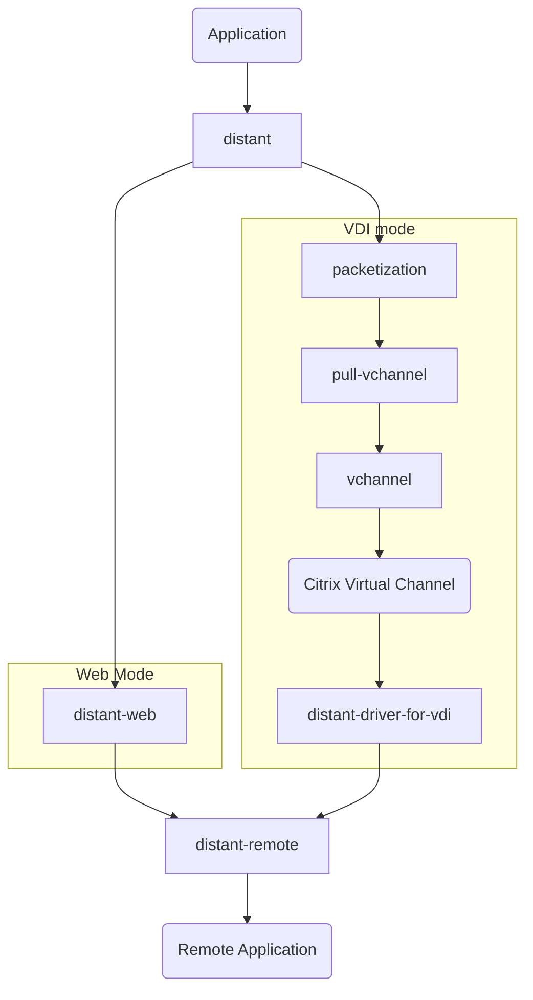

# Sample Application Layout

When building an application with Distant, it is important to understand the connections that are needed.

#### Simple distant-web application

In the diagram above you can see the 2 different modes that a Distant application can use. Notice that the VDI side is much more involved due to the limitations of the Citrix Virtual Channel.

> Note: In the future we expect to create a package that encapsulates all the required packages on the VDI side into a single connection package that simplify use in an application.
