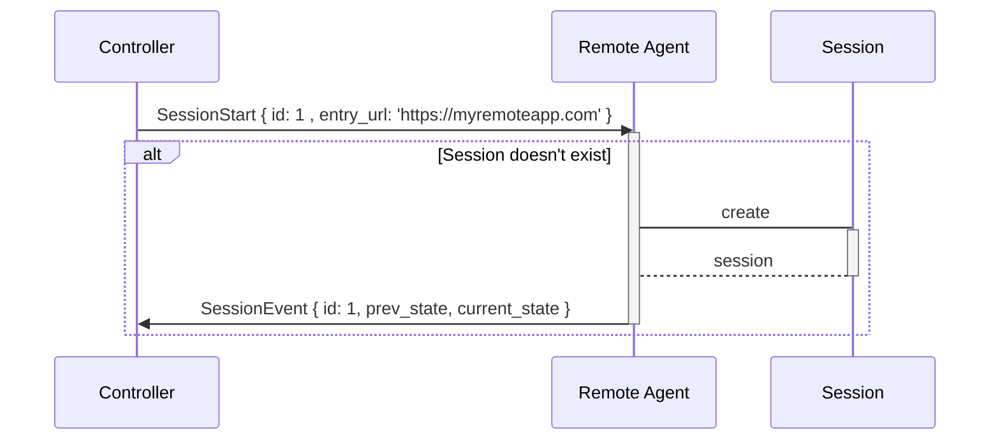
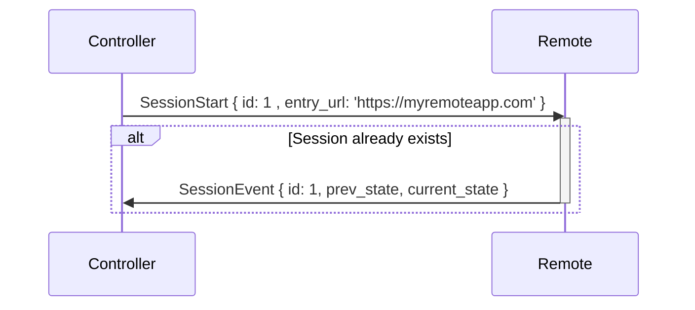
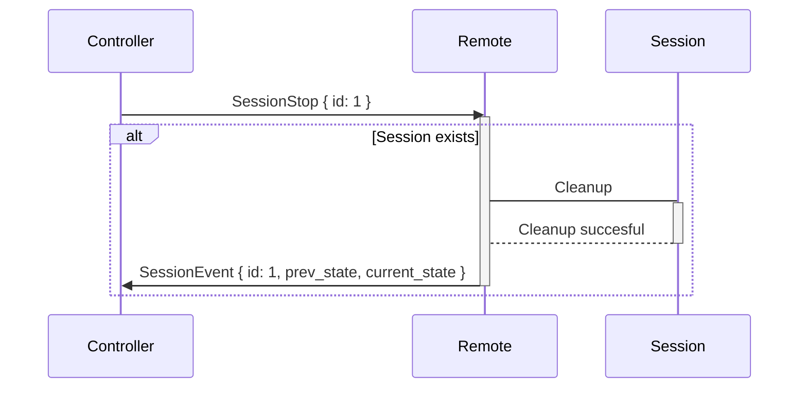
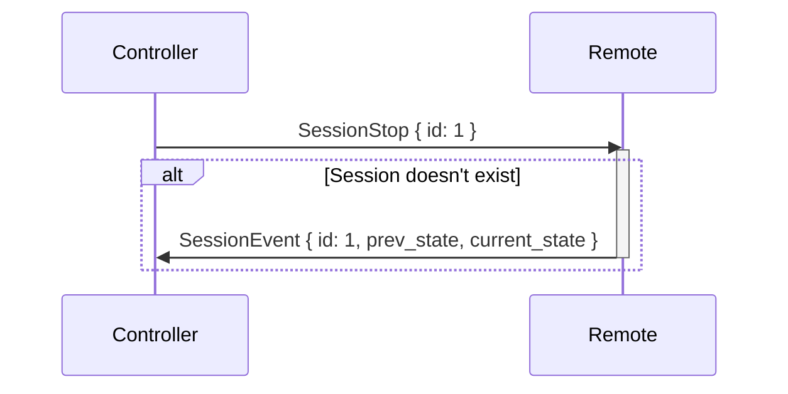
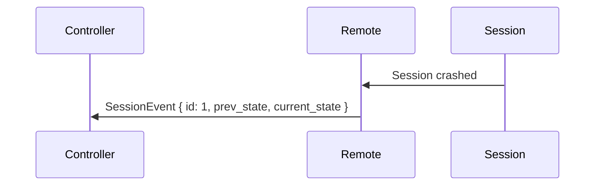
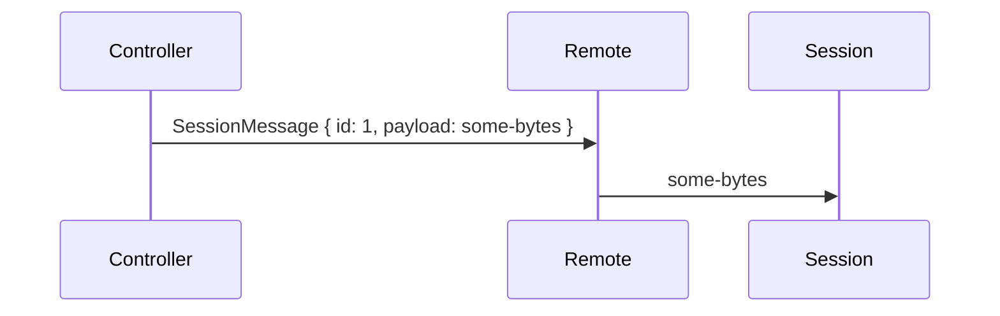
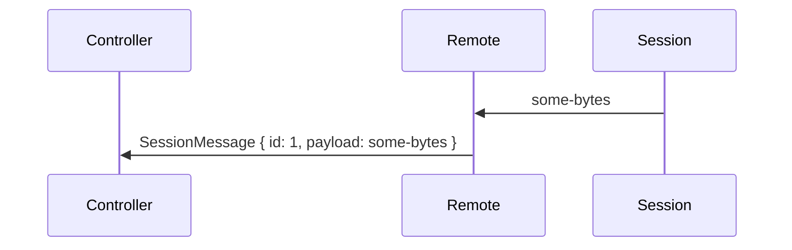

# Distant Protocol

In order to accommodate the different types of communications that Distant allows we define a flexible layered protocol. This protocol will be extensible in the future and allow enough flexibility for applications to overlay their own protocol on top of the base protocol.

## Layer 0 - Packetization

The packetization layer allows for packets of data to be split over the channel and re-assembled later. This is needed since we can deal with big packets such as WebRTC SDP packets, or big files needing to be transferred from one side to the other.

### Citrix Channel

This protocol definition makes assumptions about the underlying channel being used for communication.

In this case the channel being used is a simple byte-channel provided by the Citrix Virtual Channel SDK that allows us to write and read data. This channel already provides the capability of packetization of individual packets up to a certain size. These packets are always guaranteed delivered whole and in the correct order.

Guarantees of the channel (From the Citrix Virtual Channel SDK Programmer Guide):

> #### Packet encapsulation
>
> ICA virtual channels are packet-based, meaning that if one side performs a write with a certain amount of data, the other side receives the entire block of data when it performs a read. This contrasts with TCP, for example, which is stream-based and requires a higher-level protocol to parse out packet boundaries. Stated another way, virtual channel packets are contained within the ICA stream, which is managed separately by system software.
>
> #### Error correction
>
> ICA provides its own reliability mechanisms even when the underlying transport is unreliable. This guarantees that connections are error free and that data is received in the order in which it is sent.

One restriction of the channel is that it has a packet size limitation. This size limitation is 4996 bytes.

**Other Channel Considerations**:
Running this protocol over a different type of channel such as a UDP socket will not be reliable and will need additional work to ensure that packet delivery is ordered and guaranteed.

### Concatenation Grammar

The packetization layer is very simple and is described below in ABNF ([RFC 5234](https://tools.ietf.org/html/rfc5234)) grammar.

```abnf
total-packets = 4*OCTET
               ; The total number of packets will be sent
               ; over the wire, including the initialPacket below

initial-packet-header = total-packets

initial-packet-body = 1*4992OCTET
                    ; The remaining space of the initialPacket for data

initial-packet = initial-packet-header initial-packet-body
                ; The first packet sent over the wire, it includes
                ; information in the header

packet = 1*4996OCTET
         ; A packet is what will be sent over the wire
         ; following the initialPacket, it is only data
         ; and does not have a header

data = initial-packet-body *packet
```

Example with packets of size 8 bytes:

```abnf
packet-one = '0' '0' '0' '4' "hell"
             ; The header of 0004 indicates that there are
             ; four packets in total in this piece of data

packet-two = "o beauti"

packet-three = "ful worl"

packet-four = "d!"

data = "hello beautiful world!"

```

### Performance considerations

The simple protocol above might have some performance issues that have to lookout for. Since it relies on sending a fragmented packet all together (no interweaving of packets), it means that a large packet could monopolize the channel resources for an extended period of time.

We might need to roll-up packet interweaving, prioritization queues, etc. This should not be done initially but instead based on performance testing.

## Layer 1 - Distant Protocol

### Introduction

The distant protocol uses Google's Protocol Buffers to define messages that are passed back and forth between a Distant Controller and a remote Distant Session.

### Protocol Buffer Definition

The section below is a copy of the distant.proto file in the `@distant/distant-protocol` package. In case of differences, the one in the package is the official one.

```protobuf
syntax = "proto3";

// Note: Please note that depending on languages, the names of fields might be modified after they have been
// converted to that language. For example in JavaScript, most libraries will convert the fields
// from snake_case to camelCase.

package distant;

// ==== Session Messages ====
// Sessions correspond to a single browser session being controlled remotely.

/**
 * Start a session with the corresponding id and entry_url.
 *
 * Once started, the session will attempt to open the entry_url in order to load the remote
 * application. The controller may support the distant file access protocol, and in such circumstances
 * a URL using the `distant` scheme will attempt to load the file from the
 *
 * The id can be used by controllers to track sessions or simply for debugging purposes.
 *
 * A SessionStart will trigger one or more corresponding SessionEvents to inform of the
 * current status of the session.
 */
message SessionStart {
  int32 id = 1;         // Id for a session
  string entry_url = 2; // The entry point of a session, this points to a URL.
}

/**
 * Stop a session.
 *
 * Once the session is stopped, the controller will receive on last update that the session
 * has been stopped.
 */
 message SessionStop {
  int32 id = 1;
}

/**
 * The different statuses that a session can be in.
 */
enum SessionStatus {
  UNKNOWN = 0; // The initial state of the session.
  READY = 1;   // The session has been established and is ready to receive additional messages.
  ERROR = 2;    // The session has ended because of an error.
  CLOSED = 3;  // The session was ended successfully without error.
}

/**
 * State information of a session
 */
message SessionInfo {
  int32 id = 1;                     // Id of the session
  string entry_url = 2;             // Entry point url of a session
  distant.SessionStatus status = 3; // The current status of the session
  string error = 4;                 // If the status of the session is error, this contains information about the error.
  int32 target_status_code = 5;		  // Status code from load of remote application. Empty when no load.
                                    // Possible values are the following:
                                    // - 0 : Request received.
                                    // - 10 : Request received - CEF is currently connecting.
                                    // - 500 : Browser operation which was triggered by a request has failed.
                                    // - HTTP status codes: See here (https://en.wikipedia.org/wiki/List_of_HTTP_status_codes)
                                    // - chromium error codes: See here (https://source.chromium.org/chromium/chromium/src/+/main:net/base/net_error_list.h;drc=bad98f27515a6b830f87013c236bc6463c19ff08;l=147)
}

/**
 * An event that informs the controller of a state change in the session. This can be
 * sent in response to a command or unsolicited.
 */
message SessionEvent {
  int32 id = 1;                           // Id of the session.
  distant.SessionInfo prev_state = 2;     // The previous session state.
  distant.SessionInfo current_state = 3;  // The current session state.
}

/**
 * Send a custom message to the session or from the session. This allows applications
 * to overlay other protocols on top of the distant protocol.
 */
message SessionMessage {
  int32 id = 1;           // Id of the session.
  bytes payload = 2;      // The opaque payload of the message.
}

//==== Top Level Aggregate Messages ====

/**
 * Union of all the operations that can be performed on a remote from a controller.
 */
message Operation {
  oneof payload {
    distant.SessionStart start = 1;
    distant.SessionStop stop = 2;
    distant.SessionMessage custom_message = 4;
    distant.SessionEvent event = 5;
  };
}
```

### Operation Messages

Each message of the protocol is sent within an envelope message called `Operation`. This allows receivers to determine the type of message sent as protobuf messages are not self-describing.

Here is an example of a start session message when translated to a JavaScript format:

```javascript
const startSessionMessage = {
  start: {
    id: 1,
    // Note that bellow we use the camel case version of the field. This is a standard
    // behavior for protobuf.js framework.
    targetUrl: 'https://myremote.org'
  }
}
```

### Control Behaviour

The protocol is also defined with a certain mandated behaviour of message-response control sequences. Here is a list of all these sequences.

#### 1. Starting a session

##### 1.1 - Successful Start

Here we show the control sequence of starting a session successfully.



The `prev_state` and `current_state` will have the following information for a successful creation:

```javascript
prev_state = {
  id: 1,
  entry_url: '',
  status: UNKNOWN,
  error: ''
}

current_state = {
  id: 1,
  entry_url: 'https://myremoteapp.com',
  status: READY,
  error: ''
}
```

##### 1.2 - Start an already existing session

The id of a session is determined by the session creator. As such it's possible to attempt creating a session with the same id. In that case, the remote should simply respond with a prev_state that shows the session was already created.



The `prev_state` and `current_state` will have the following information for a session that was already started.

```javascript
prev_state = {
  id: 1,
  entry_url: 'https://myremoteapp.com',
  status: READY,
  error: ''
}

current_state = {
  id: 1,
  entry_url: 'https://myremoteapp.com',
  status: READY,
  error: ''
}
```

##### 1.3 - Failure to start a session

When creating a session, it's possible that this process doesn't succeed for a variety of reasons. In such a case, the remote should respond with an event that describes the error.


The `prev_state` and `current_state` will have the following information for a session that failed to be created.

```javascript
prev_state = {
  id: 1,
  entry_url: '',
  status: UNKNOWN,
  error: ''
}

current_state = {
  id: 1,
  entry_url: '',
  status: ERROR,
  error: 'The session failed to be created because of some reason'
}
```

#### 2. Stopping a Session

##### 2.1 - Successfully stopping an existing session

Here we show the control sequence of stopping a session successfully.



The `prev_state` and `current_state` will have the following information for a successful session stop:

```javascript
prev_state = {
  id: 1,
  entry_url: 'https://myremoteapp.com',
  status: READY,
  error: ''
}

current_state = {
  id: 1,
  entry_url: '',
  status: CLOSED,
  error: ''
}
```

##### 2.2 - Stopping a session that doesn't exist

When attempting to stop a session that doesn't exist, the protocol simply reports the before and after state of the session with the id. In this case, it doesn't know any session with this id.



The `prev_state` and `current_state` will have the following information for a successful session stop:

```javascript
prev_state = {
  id: 1,
  entry_url: '',
  status: UNKNOWN,
  error: ''
}

current_state = {
  id: 1,
  entry_url: '',
  status: UNKNOWN,
  error: ''
}
```

##### 2.3 - Failing to stop a session

When attempting to stop a session, but something goes wrong in the cleanup, the remote side should respond with some information about the failure. The session is still considered to be closed in such a scenario and messages can no longer be passed for this session.


The `prev_state` and `current_state` will have the following information for a successful session stop:

```javascript
prev_state = {
  id: 1,
  entry_url: 'https://myremoteapp.com',
  status: READY,
  error: ''
}

current_state = {
  id: 1,
  entry_url: '',
  status: CLOSED,
  error: 'Failed to properly cleanup session because of some reason'
}
```

#### 3 - Session Update

Session update is now deprecated

#### 4 - Session events

The remote will keep the controller informed of any state changes for any session it manages. It will do so by sending unsolicited events when this state changes.

##### 4.1 - An error occurred and a session has ended



Here is an example for the values of prev_state and current_state:

```javascript
prev_state = {
  id: 1,
  entry_url: 'https://myremoteapp.com',
  status: READY,
  error: ''
}

current_state = {
  id: 1,
  entry_url: '',
  status: ERROR,
  error: 'Session ended because of an unknown error'
}
```

> Note: An ERROR or CLOSED status always means that the session is ended and can no longer be reached. CLOSED is used when the session was closed as result of a normal user operation, ERROR is used in other cases.

#### 5 - Sending custom messages

The protocol defines a way for the controller and the remote to send each other custom messages. These messages are intended as application defined messages and are not inspected by the controller or the remote. They are simply passed along from the controller to the session or vice-versa.

Note that for these messages, there is no acknowledgement by the other side that the message was received or not. It is up to the implementation to determine whether messages were successfully sent via a timeout or some other mechanism.

##### 5.1 - Controller to remote



##### 5.2 - Remote to controller


